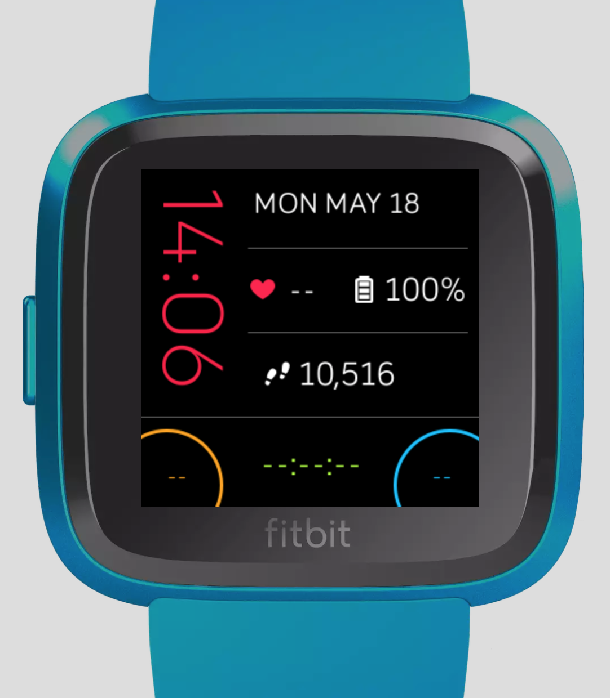

# fitbit-tooloclock

A Fitbit Versa clock face showing a subset of metrics and some extra buttons to keep track of daily actions

## Changelog

### Alpha

- *chronometer* on the central button (long press to reset)
- switch visualization mode to *tachymeter* on drag down the chronometer
- button behaviour change: button do not reset with the new day, improved longclick
- bugfix: clock time was truncated

### v0.1.0 - 18/05/2020

- Simple clock with cardio and steps metrics
- Battery indicator
- Configurable time log for reminders
  - _use cases_: do I have took the pill? have I given to my baby the vitamin D today? at what time my baby start to sleep? at what time the water start to boil?
  - _behaviour_: on long click (0.5s for the side buttons, 0s for the central one) is logged the time, after midnight are reset the 2 side buttons, longer click (2s) force reset

## Screenshots

## Backlog

- [ ] reverse the side of the digital clock
- [ ] Improve design and usability
- [ ] Clean and style the code
- [ ] Settings configuration (name, color, enable/disable, left handed version, disable daily reset)
- [ ] Enable a second timezone (see [fitbit-dual-clockface](https://github.com/edinbb/fitbit-dual-clockface))
- [ ] Mood tracker [?]
- [ ] Backend service to export all the reminder's logs and a visualization page on the browser [?]
- [ ] Button mode: counter [?] (how many times I did this?)
- [ ] Button mode: Cronomether (start/stop/reset) [?] (how long I'm doing this?)

## Testing

I've tested the application only on my Fitbit Versa 2

## How to build

*Prerequisites*: Node.js 10.x+

> npm install

> npx fitbit

> $fitbit: connect phone

> $fitbit: connect device

> $fitbit: bi

You can read Fitbit's [CLI Reference](https://dev.fitbit.com/build/guides/command-line-interface/#building-and-installing-your-project) to learn how to build and deploy this face to your device.

## Contributing

Any contribution is welcome! Requests and suggestions are welcome too! :)

## Resources

- [sdk-moment](https://github.com/Fitbit/sdk-moment)
- [metrix-fitbit](https://github.com/rootasjey/metrix-fitbit)
- [Fitbit Assets](https://github.com/Fitbit/sdk-design-assets)
- Template: [create-fitbit-app](https://github.com/Fitbit/sdk-design-assets)
